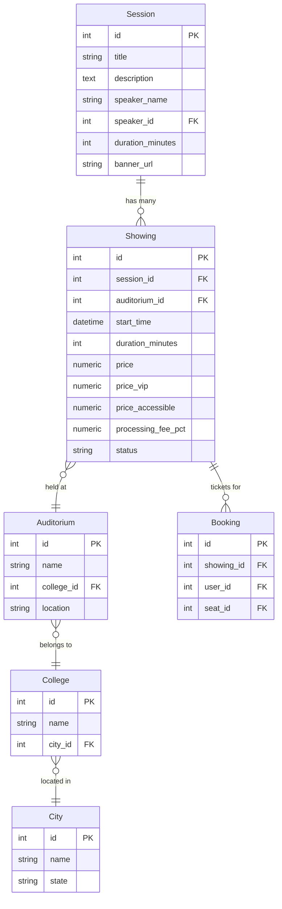
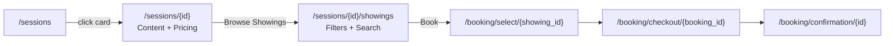
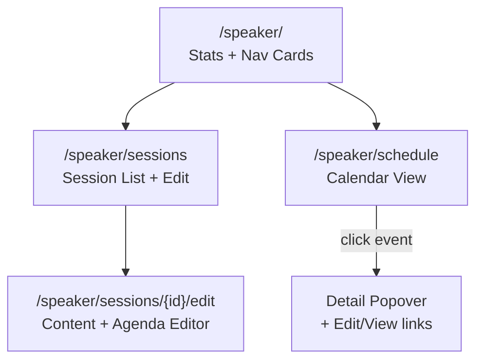
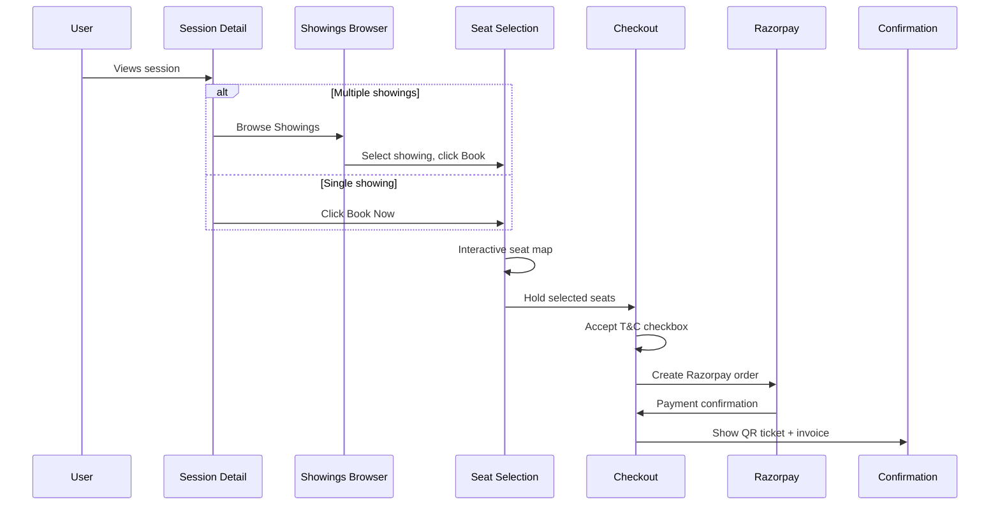
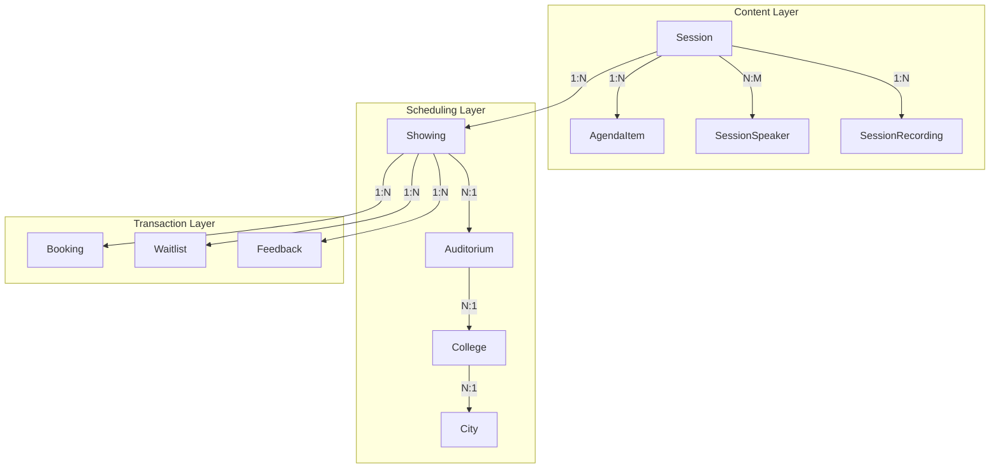

# TechTrek -- Architecture & Restructuring Document

**Date:** 13 March 2026
**Scope:** Session/Showing model refactor, multi-showing UI, scalable showing browser, speaker portal redesign, and supporting infrastructure changes

---

## Executive Summary

TechTrek was originally built around a one-session-equals-one-event model: each session had a single date, time, venue, and price. This created a practical problem -- the same talk delivered at multiple venues or dates required duplicating the entire session record, including its description, agenda, speakers, and recordings.

This document describes the architectural restructuring that separated **content** (what the session is) from **scheduling** (when and where it happens), and the cascading frontend and backend changes that followed.

---

## 1. The Session/Showing Model

### Before

```
Session
  - title, description, speaker, agenda
  - start_time, auditorium_id, price, status
  - bookings (direct FK)
```

Every piece of data lived on one object. Changing the time of a talk at one venue required editing the session itself. Offering the same talk in two cities meant creating two sessions with copy-pasted content.

### After



**Session** holds immutable content: title, description, speakers, agenda items, recordings. **Showing** holds scheduling: when, where, at what price, and its booking status. A single session can have 1 or 50 showings across different venues and dates.

### Migration

The refactor was applied via Alembic migrations. Existing session records were split: content fields stayed on `sessions`, while scheduling fields moved to a new `showings` row linked by `session_id`. All `bookings.session_id` references were migrated to `bookings.showing_id`.

---

## 2. Application Structure

### Models (22 files)

```
app/models/
  session.py          Content: title, description, speakers, duration
  showing.py          Scheduling: start_time, auditorium, price, status
  booking.py          Ticket: user + showing + seat
  auditorium.py       Venue with seat layout (rows, cols, gaps)
  seat.py             Individual seat within an auditorium
  seat_type.py        Custom seat categories with pricing
  college.py          Institution (has auditoriums)
  city.py             Geographic grouping of colleges
  event.py            Multi-session event grouping
  event_showing.py    Links showings to events
  speaker.py          Speaker profile (linked to user account)
  session_speaker.py  Many-to-many session-speaker assignments
  session_recording.py Video recordings attached to sessions
  agenda.py           Ordered agenda items within a session
  user.py             User accounts with encrypted PII
  feedback.py         Post-session feedback and ratings
  testimonial.py      Public testimonials + newsletter subscribers
  waitlist.py         Waitlist entries with priority booking
  activity_log.py     Admin action audit trail
  webhook_log.py      Payment webhook records
  site_setting.py     Key-value platform configuration
```

### Routers (7 files)

```
app/routers/
  public.py       Public pages: home, sessions list, session detail,
                   showings browser, events, schedule, recordings,
                   feedback, terms
  admin.py        Admin panel: dashboard, CRUD for all entities,
                   showing management, certificate preview, check-in
  booking.py      Booking flow: seat selection, checkout, payment,
                   confirmation, cancellation, waitlist
  auth.py         Login, registration, profile, password management
  speaker.py      Speaker portal: dashboard, sessions list, calendar
                   schedule, session content editing, profile
  supervisor.py   On-site check-in interface for event staff
  webhook.py      Razorpay payment webhook handler
```

### Templates (62 files across 8 directories)

```
app/templates/
  base.html                    Master layout (navbar, footer, themes)
  public/     (13 templates)   User-facing pages
  admin/      (28 templates)   Admin panel
  booking/    (9 templates)    Booking flow
  auth/       (3 templates)    Authentication
  speaker/    (5 templates)    Speaker portal
  supervisor/ (1 template)     Staff check-in
  errors/     (2 templates)    404 and 500 pages
```

---

## 3. User-Facing Flow (Public)

### Sessions List (`/sessions`)

The sessions list page displays one card per **showing**, not per session. Each card shows:

- Session title and speaker name
- Showing date, time, and venue (auditorium name + location)
- Price and seat availability with a visual progress bar
- A "N showings" badge if the session has multiple dates/venues

Cards link to the session detail page.

### Session Detail (`/sessions/{id}`)

The session detail page is purely about **content**:

- Hero section with the session title, nearest showing date, and venue
- Speaker bios (primary + guest speakers via session_speakers)
- Description and agenda items
- Session recordings (gated to ticket holders)

The right sidebar contains:

- **Pricing card** -- shows "Starting from" price (cheapest showing), VIP/accessible/custom seat type tiers, seat availability, and a Book Now button for single-showing sessions
- **Venues card** (multi-showing only) -- a compact fixed-height card listing deduplicated auditorium/college/city combinations with showing counts, and a prominent "Browse N Showings" button

### Showings Browser (`/sessions/{id}/showings`)

For sessions with multiple showings, a dedicated full-page browser provides:

- Text search across venue name, college, and city
- Date picker filter
- City and college cascading dropdowns
- Sort by date, price, or availability
- Availability toggle pills (All / Available / Filling Up)
- Showing cards with date block, venue details, pricing, availability bar, and Book button
- AJAX-powered live filtering with debounced search

After selecting a showing, the user proceeds to the standard seat selection and checkout flow.



---

## 4. Admin Panel (`/admin`)

### Session Management

Sessions are managed through a multi-step wizard:

1. **Showings** -- list of all showings with add/edit/delete controls. Each showing has its own venue, date/time, price tiers, and status.
2. **Details** -- session title, description, banner image, duration
3. **Speakers** -- primary speaker assignment and guest speaker management
4. **Agenda** -- ordered agenda items with per-item speaker and duration
5. **Certificate** -- certificate template preview
6. **Review & Save** -- summary and save

Showings are managed inline within the session wizard (Step 1), with CRUD routes at `/admin/sessions/{id}/showings/new`, `.../edit`, and `.../delete`.

### Other Admin Features

- **Dashboard** with revenue, booking, and user statistics
- **Cities / Colleges / Auditoriums** hierarchy management
- **Auditorium seat designer** with visual row/col grid, custom seat types, gaps, stage positioning
- **Bookings** list with search, cancellation, and invoice generation
- **Waitlist** management with priority granting
- **Schedule** calendar view of all showings
- **Check-in** QR-code-based attendance tracking
- **Events** multi-session event packaging
- **Speakers** profile management
- **Feedback** review and moderation
- **Activity Log** audit trail of all admin actions
- **Settings** platform branding (logo, company details for invoices)

---

## 5. Speaker Portal (`/speaker`)

The speaker portal was restructured from a single dashboard into three focused pages:

### Dashboard (`/speaker/`)

A landing page with:

- Stats cards (Total Sessions, Upcoming, Completed)
- Two navigation cards linking to My Sessions and My Schedule

### Sessions List (`/speaker/sessions`)

A table of all sessions the speaker is linked to (as primary speaker, guest speaker, or agenda item speaker), showing:

- Session title
- Number of showings
- Next upcoming showing date
- Total bookings across all showings
- Edit and View Public Page links

### Schedule Calendar (`/speaker/schedule`)

A full calendar view of all showings across the speaker's sessions:

**Month View** -- 7-column Monday-first grid with day cells containing compact event chips. Each chip shows a status-colored dot (cyan = published, amber = draft, grey = completed, red = cancelled), time, and truncated session title.

**Week View** -- 7-column grid with event blocks showing time, session title, venue name, duration, and booking count.

Both views support:

- Month/Week toggle via pill buttons
- Previous/Next navigation
- Today button to jump to current period
- Click-to-open detail popover with full showing info (date, time, venue, location, price, bookings, status) and links to edit the session or view its public page



---

## 6. Booking Flow



### Pricing Resolution

For each seat, the system resolves the price in this order:

1. If seat type is `vip` -> `showing.price_vip`
2. If seat type is `accessible` -> `showing.price_accessible`
3. If seat type is `custom_{id}` -> `seat_types.price` (looked up by ID)
4. Otherwise -> `showing.price` (standard)

A processing fee percentage (set per showing) is applied at checkout as a separate line item.

---

## 7. Frontend Architecture

### CSS

All styles are in a single `app/static/css/style.css` file (~4800 lines) using CSS custom properties for theming. The design system includes:

- Dark theme (default) and light theme via `[data-theme="light"]` overrides
- Component classes: `.card`, `.btn`, `.form-input`, `.table`, `.badge`, `.filter-bar`
- Page-specific classes: `.session-hero`, `.session-booking-card`, `.spk-cal-grid-month`
- Responsive breakpoints at 480px, 600px, 768px, 1024px
- Print styles for tickets and invoices

### JavaScript

Client-side JS is minimal and inline (in template `` blocks), with two standalone modules:

- `seat-designer.js` -- Admin auditorium layout editor
- `seat-picker.js` -- User-facing interactive seat selection

All list pages (sessions, showings browser) use a shared pattern: debounced input listeners trigger `fetch()`, parse the response with `DOMParser`, and swap the grid content. TomSelect is used for searchable dropdowns with cascading (city filters college options).

### Theming

```
:root (dark)           [data-theme="light"]
--bg-primary: #0a0f1c  --bg-primary: #f0f4f8
--cyan: #00d4ff        mapped to: #0881a2
--text-primary: #e2e8  mapped to: #1e293b
```

Every new component added during this restructuring includes both dark and light theme rules.

---

## 8. Testing

The test suite (`tests/`) uses pytest with an in-memory SQLite database and Starlette's `TestClient`. Key test infrastructure:

- **`conftest.py`** -- database setup, dependency overrides, data factories (`make_user`, `make_session`, `make_showing`, `make_auditorium`, `make_speaker`, `make_booking`, `make_recording`, `make_feedback`)
- **`test_public_pages.py`** -- home page, sessions list, session detail, schedule, recordings
- **`test_admin_pages.py`** -- admin dashboard, schedule, bookings, session form, recordings, speaker dashboard/sessions/schedule, showing CRUD, showings browser, seat form
- **`test_feedback.py`** -- feedback form and submission

All 52 tests pass. Tests cover both single-showing and multi-showing scenarios, including the new showings browser page, venues card rendering, and speaker calendar views.

---

## 9. Deployment

`deploy.py` is a single-file deployment runner that:

1. Checks Python version (3.11+ required)
2. Installs dependencies from `requirements.txt`
3. Validates `.env` configuration (SECRET_KEY, DATABASE_URL, FIELD_ENCRYPTION_KEY)
4. Runs Alembic migrations (`alembic upgrade head`)
5. Starts the production server via uvicorn

The script handles Windows terminal encoding (UTF-8 reconfiguration for PowerShell compatibility).

---

## 10. Data Flow Summary



The clean separation between content and scheduling means:

- A session's title, description, and agenda are edited once and apply to all showings
- Each showing independently manages its own venue, date, pricing, and booking status
- The public UI can scale from 1 showing to 50+ showings per session without layout changes
- Speakers see all their showings across all sessions in a single calendar view

---

*TechTrek Architecture Document -- 13 March 2026*
