# TechTrek — Development Summary
**Date:** Friday, 13 March 2026
**Session:** Full-day feature sprint

---

## Overview

Seven features were designed, planned, and fully implemented across the TechTrek event booking platform today. The changes span the entire application stack — database models, backend routes, service layer, Jinja2 templates, and client-side JavaScript.

---

## Feature Map

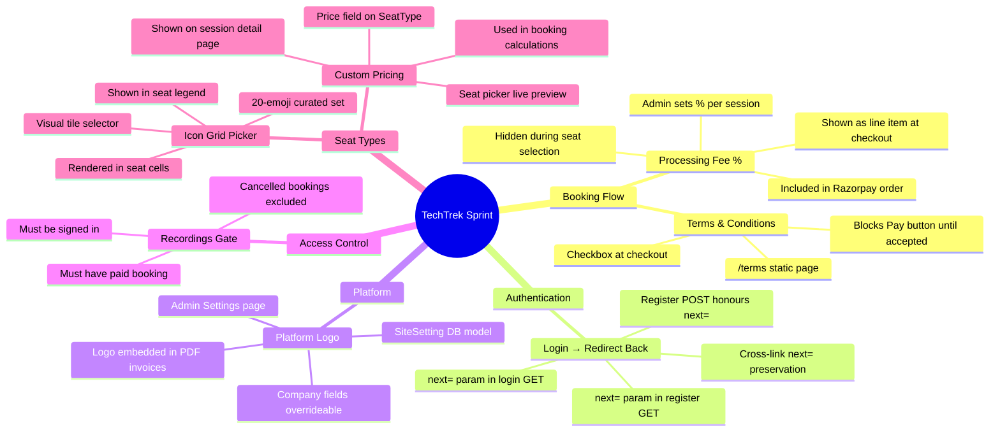

---

## 1. Processing Fee Percentage

### Problem
Admins had no way to charge a platform/gateway processing fee on top of ticket prices. The fee needed to be invisible during seat selection but clearly broken out at checkout.

### Solution

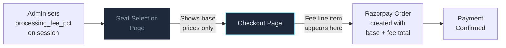

**Checkout breakdown (example):**
```
Seat A3 (VIP)          ₹800
Seat B7 (Standard)     ₹500
Processing Fee (2.5%)   ₹33
─────────────────────────────
Total                 ₹1,333
```

### Files Changed
| File | Change |
|------|--------|
| `app/models/session.py` | Added `processing_fee_pct NUMERIC(5,2)` column |
| `app/routers/admin.py` | Save fee % in session create/update handlers |
| `app/templates/admin/session_form.html` | New "Processing Fee (%)" input in Step 2 pricing |
| `app/routers/booking.py` | `checkout_page()` calculates `base_total`, `processing_fee`, `total` |
| `app/routers/booking.py` | `create_order()` includes fee in Razorpay paise amount |
| `app/templates/booking/checkout.html` | Conditional fee line item in summary |

---

## 2. Login / Signup → Redirect Back to Session

### Problem
When an unauthenticated user clicked a session's "Book" or "Sign in" button, they were sent to login/register, but after completing auth they always landed on the home page — losing their place.

### Root Cause Analysis

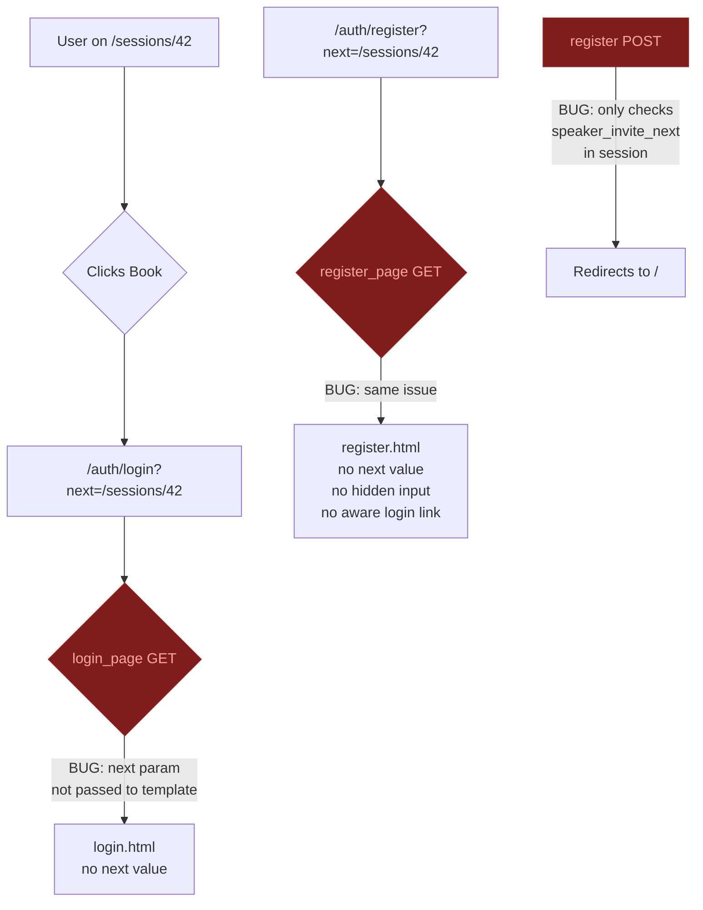

### Fixed Flow

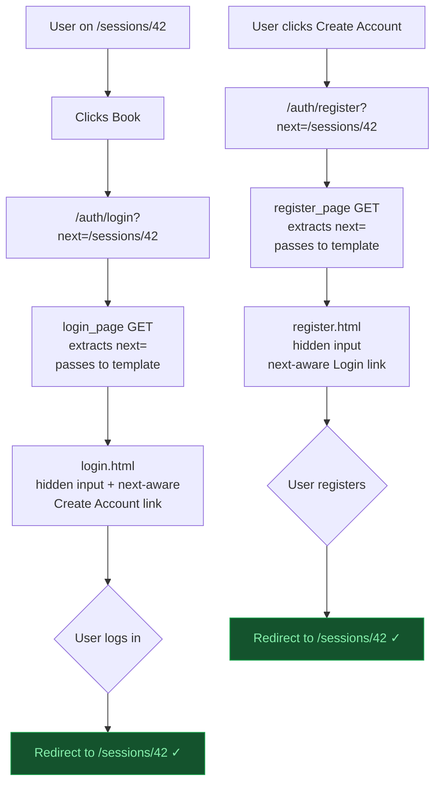

### Files Changed
| File | Change |
|------|--------|
| `app/routers/auth.py` | `login_page` GET extracts `?next=` and passes to template |
| `app/routers/auth.py` | `register_page` GET does the same |
| `app/routers/auth.py` | `register` POST checks form `next` → query param → session → `/` |
| `app/routers/auth.py` | Validation failure redirect preserves `?next=` |
| `app/templates/auth/register.html` | Hidden `<input name="next">` added to form |
| `app/templates/auth/register.html` | "Already have an account?" link is `next=`-aware |

---

## 3. Platform Logo on Invoices

### Architecture

A new `SiteSetting` key-value model was introduced to allow runtime configuration of platform branding without code changes or server restarts.

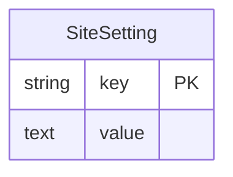

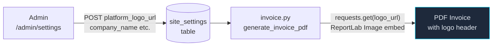

**Invoice header layout:**
```
┌──────────────────────────────────────────────────┐
│ [LOGO]  TechTrek Pvt Ltd          TAX INVOICE   │
│         Bangalore, Karnataka      #INV-20260313  │
│         GSTIN: ... | PAN: ...     Date: 13 Mar   │
│─────────────────────────────────────────────────│
```

### Files Changed
| File | Change |
|------|--------|
| `app/models/site_setting.py` | **New** — key/value DB model |
| `app/models/__init__.py` | Registered `SiteSetting` for `create_all` |
| `app/routers/admin.py` | `GET/POST /admin/settings` routes + `_load_settings()` helper |
| `app/templates/admin/settings.html` | **New** — settings form with logo preview |
| `app/templates/admin/base_admin.html` | "Settings" link in sidebar nav |
| `app/services/invoice.py` | Accepts `db`, loads settings from DB, embeds logo via ReportLab |
| `app/routers/booking.py` | Passes `db` to `generate_invoice_pdf()` |
| `app/routers/admin.py` | Passes `db` to `generate_invoice_pdf()` |

---

## 4. Recordings Page — Ticket Holders Only

### Problem
The `/recordings` page showed all public session recordings to anyone, including unauthenticated users and people who never bought a ticket.

### Access Control Logic

```mermaid
flowchart TD
    A[GET /recordings] --> B{Signed in?}
    B -- No --> C[Flash: Sign in to view recordings]
    C --> D[Redirect to /auth/login?next=/recordings]
    B -- Yes --> E[Query sessions with\npublic recordings]
    E --> F[Intersect with sessions\nwhere user has\npayment_status == 'paid']
    F --> G{Any results?}
    G -- Yes --> H[Show recordings grid]
    G -- No --> I[Show empty state\n"No recordings yet\nfor your bookings"]

    style D fill:#1e293b,stroke:#f59e0b,color:#fde68a
    style H fill:#14532d,stroke:#16a34a,color:#86efac
```

### Files Changed
| File | Change |
|------|--------|
| `app/routers/public.py` | `recordings_page()` — auth gate + paid-booking filter |

---

## 5. Terms & Conditions at Checkout

### Problem
Users could complete payment with no acknowledgement of refund policy or platform terms — a legal and operational risk.

### Implementation

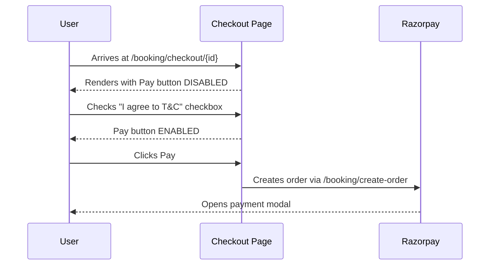

**Checkout UI:**
```
┌─────────────────────────────────────────────────┐
│  ☐  I agree to the Terms & Conditions and       │
│     understand that tickets are non-refundable  │
│     after payment.                              │
│                                                 │
│  [ Pay ₹1,333 ]  ← disabled until checked      │
└─────────────────────────────────────────────────┘
```

### Files Changed
| File | Change |
|------|--------|
| `app/templates/booking/checkout.html` | T&C checkbox + JS enable/disable logic |
| `app/templates/public/terms.html` | **New** — `/terms` page with boilerplate legal content |
| `app/routers/public.py` | `GET /terms` route |

---

## 6. Custom Seat Type Icon Grid Picker

### Problem
The admin icon field for custom seat types was a free-text input (`fa-star`, `fa-crown` etc.) with no visual feedback and no consistency.

### Before → After

```
BEFORE:                           AFTER:
┌──────────────────────┐         ┌───────────────────────────────────┐
│ Icon Class:          │         │ Icon:                             │
│ [fa-star___________] │         │ ⭐  👑  💎  🎭  🌟  🔥  🎪  🏆  │
└──────────────────────┘         │ ♿  🎟️  💺  🎯  🌙  ❄️  🌈  🎵  │
                                 │ 🏅  💡  🔑  🎨                   │
                                 │                                   │
                                 │ [✕ No icon]                       │
                                 │ Selected: 👑                      │
                                 └───────────────────────────────────┘
```

The selected icon is stored as the emoji character in `seat_types.icon` (fits in `VARCHAR(30)`).

### Icon Propagation

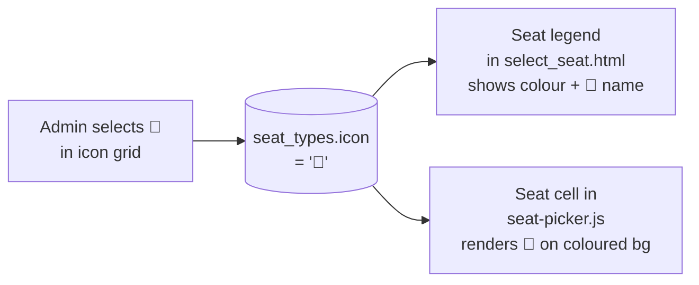

### Files Changed
| File | Change |
|------|--------|
| `app/templates/admin/seat_type_form.html` | Replaced text input with emoji grid + JS tile selector |
| `app/templates/booking/select_seat.html` | Legend renders icon emoji next to type name |
| `app/static/js/seat-picker.js` | Custom seat cells render the icon emoji |

---

## 7. Custom Seat Type Pricing

### Problem
Custom seat types (e.g. "Premium", "Balcony") had no pricing — they always fell back to the session's standard price. They were also not visible on the session detail page.

### Data Model Change

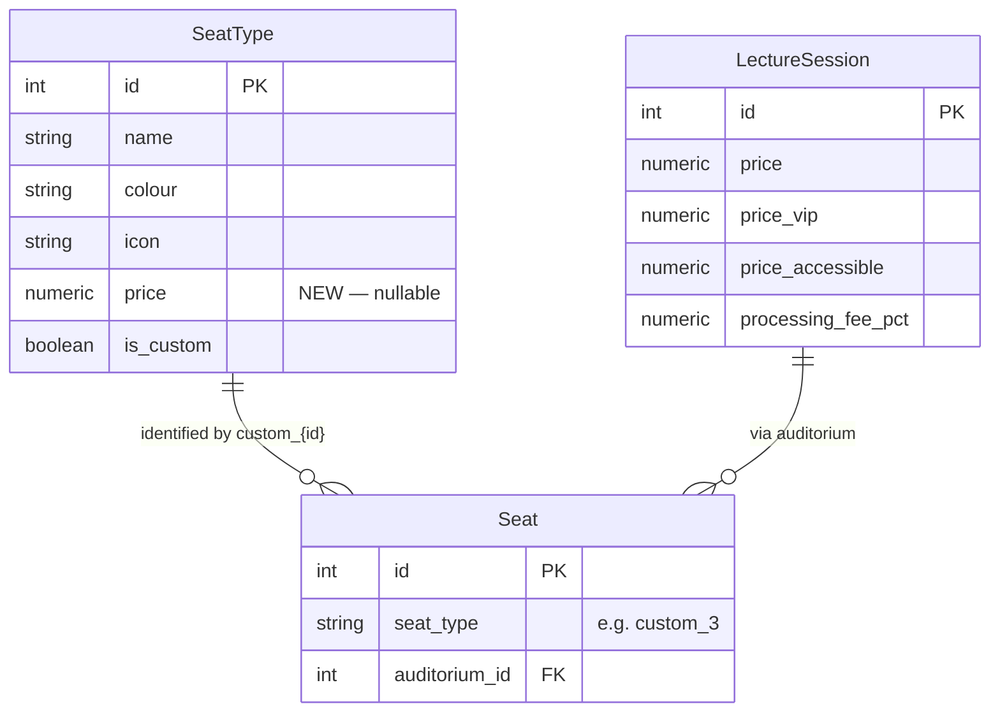

### Pricing Resolution (booking calculation)

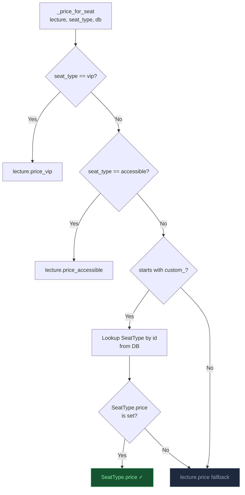

### Session Detail Price Display

```
Starting from  ₹500 per seat
  VIP · ₹900    Accessible · ₹400    👑 Premium · ₹750    🎟️ Balcony · ₹600
```

### Files Changed
| File | Change |
|------|--------|
| `app/models/seat_type.py` | Added `price NUMERIC(10,2)` column |
| `app/templates/admin/seat_type_form.html` | Price input field added |
| `app/routers/admin.py` | Saves price in `seat_type_create` and `seat_type_update` |
| `app/routers/public.py` | `session_detail()` queries custom types for the auditorium |
| `app/templates/public/session_detail.html` | Custom type price pills in pricing section |
| `app/services/booking.py` | `_price_for_seat()` looks up custom type DB price |
| `app/routers/booking.py` | `custom_types_data` includes `price`; passes `db` to `_seat_price` |
| `app/static/js/seat-picker.js` | `priceForType()` uses `ct.price` for live summary |

---

## Database Changes

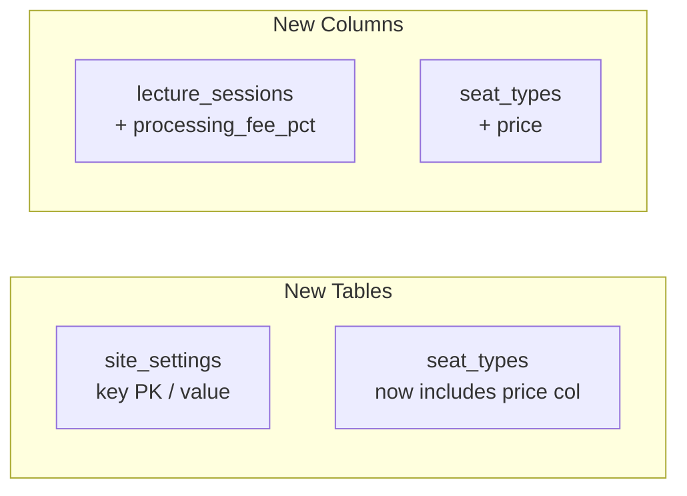

All migrations are handled in `app/main.py` via `ALTER TABLE ... ADD COLUMN IF NOT EXISTS` inside the startup `with engine.connect()` block, consistent with the project's existing migration pattern.

| Table | Column Added | Type |
|-------|-------------|------|
| `lecture_sessions` | `processing_fee_pct` | `NUMERIC(5,2) DEFAULT 0` |
| `seat_types` | `price` | `NUMERIC(10,2)` |
| `site_settings` | *(new table)* | `key VARCHAR(100) PK, value TEXT` |

---

## Full Change File Index

| File | Status | Feature(s) |
|------|--------|------------|
| `app/models/session.py` | Modified | Processing fee |
| `app/models/seat_type.py` | Modified | Custom pricing |
| `app/models/site_setting.py` | **Created** | Platform logo |
| `app/models/__init__.py` | Modified | Register SiteSetting |
| `app/main.py` | Modified | DB migrations |
| `app/routers/auth.py` | Modified | Login redirect |
| `app/routers/admin.py` | Modified | Fee, logo settings, seat type price |
| `app/routers/booking.py` | Modified | Fee calc, T&C, custom pricing |
| `app/routers/public.py` | Modified | Recordings gate, session detail, /terms |
| `app/services/invoice.py` | Modified | Logo in PDF |
| `app/services/booking.py` | Modified | Custom type price lookup |
| `app/static/js/seat-picker.js` | Modified | Icon render, custom price |
| `app/templates/admin/base_admin.html` | Modified | Settings nav link |
| `app/templates/admin/session_form.html` | Modified | Processing fee input |
| `app/templates/admin/seat_type_form.html` | Modified | Icon grid, price input |
| `app/templates/admin/settings.html` | **Created** | Platform settings page |
| `app/templates/auth/login.html` | *(already handled next=)* | Login redirect |
| `app/templates/auth/register.html` | Modified | Login redirect |
| `app/templates/booking/checkout.html` | Modified | Fee display, T&C checkbox |
| `app/templates/booking/select_seat.html` | Modified | Icon in legend |
| `app/templates/public/session_detail.html` | Modified | Custom type price pills |
| `app/templates/public/terms.html` | **Created** | T&C page |

---

*Generated 13 March 2026 — TechTrek internal development log*
